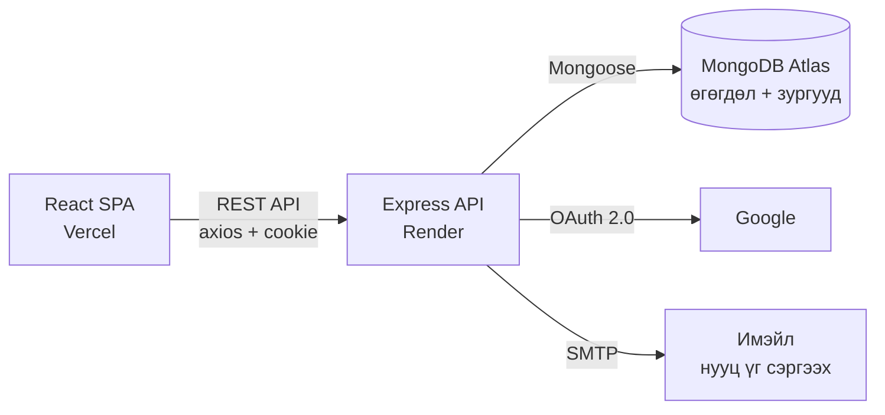
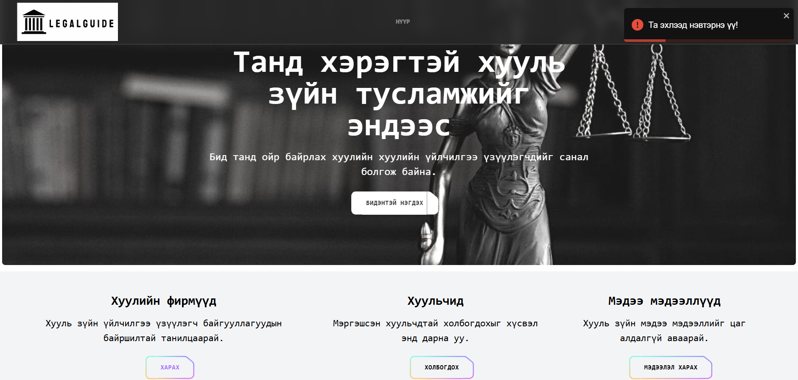
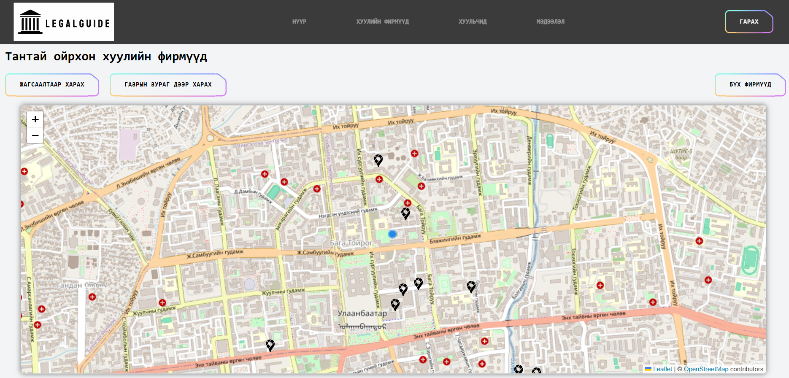
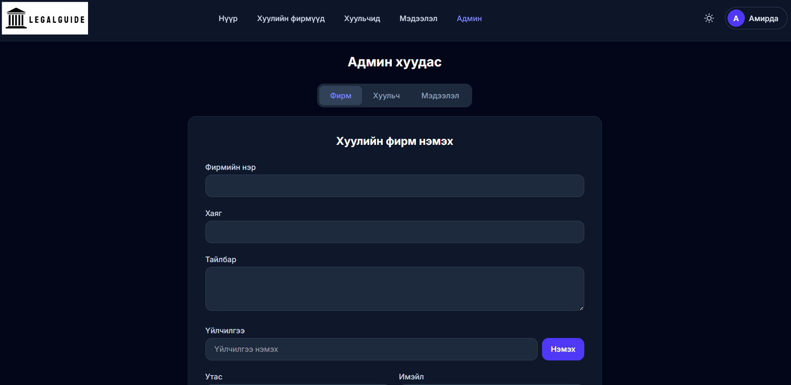

# ⚖️ LegalGuide — Map based legal advice agency finder

Хуулийн үйлчилгээ үзүүлэгч байгууллага, хуульчдыг газрын зургаас хайж олох, харьцуулах, сэтгэгдэл үлдээх боломжтой бүрэн ажиллагаатай веб систем.

**🌐 Live demo:** https://legal-guide-three.vercel.app

> *EN: A full-stack web app for finding legal service providers (law firms and lawyers) near you on an interactive map — with reviews, role-based admin panel, Google OAuth, and legal info articles. Built with React 19, Express, and MongoDB.*

---

## ✨ Гол боломжууд

- 🗺 **Газрын зурагт хайлт** — Leaflet ашиглан хэрэглэгчийн байршилд ойр фирмүүдийг зайгаар нь эрэмбэлж харуулна (Haversine formula, bounding-box query)
- 🏢 **Фирм ба хуульчдын каталог** — үйлчилгээний төрлөөр шүүх, дэлгэрэнгүй мэдээлэл
- 💬 **Сэтгэгдлийн систем** — нэвтэрсэн хэрэглэгч фирм дээр сэтгэгдэл үлдээх, өөрийн сэтгэгдлээ засах/устгах, admin бүх сэтгэгдлийг удирдах
- 📰 **Хууль зүйн мэдээлэл** — Markdown editor-той нийтлэлийн хэсэг
- 🔐 **Нэвтрэлт** — JWT + httpOnly cookie, Google OAuth 2.0 (Passport), нууц үг сэргээх имэйл (Nodemailer)
- 👨‍💼 **Admin panel** — role-based хандалт, фирм/хуульч/мэдээллийн бүрэн CRUD
- 🖼 **Зургийн хадгалалт** — зургуудыг MongoDB-д Buffer хэлбэрээр хадгалж, өөрийн API endpoint-оор үзүүлдэг (гадны storage үйлчилгээнээс хараат бус)

## 🛠 Технологи

| Хэсэг | Стек |
|---|---|
| Frontend | React 19, Vite 6, React Router 7, TanStack Query, Tailwind CSS 4, Leaflet, Axios |
| Backend | Node.js, Express 4, Mongoose 8, Passport (Google OAuth 2.0), JWT, Nodemailer |
| Өгөгдлийн сан | MongoDB Atlas |
| Deployment | Vercel (frontend) · Render (backend) · GitHub Pages (нөөц) |

## 🏗 Архитектур



- Route → Controller → Model давхаргатай REST API (`/api/v1/{users,firms,lawyers,infos}`)
- Төвлөрсөн алдааны middleware + custom `MyError` класс, async handler wrapper
- CORS whitelist, `trust proxy`, cross-site cookie (`SameSite=None; Secure`) production тохиргоо

## 🧩 Шийдсэн сонирхолтой асуудлууд

1. **Firebase Storage → MongoDB шилжилт.** Firebase-ийн subscription дууссанаас зургууд ажиллахгүй болсныг зургийг MongoDB document дотор Buffer-ээр хадгалж (`select: false`-аар жагсаалтын query-г хөнгөн байлгаж), `GET /:id/photo` endpoint-оор Content-Type-тэй нь үзүүлдэг болгож шийдсэн.
2. **Domain солигдоход зураг эвдрэхгүй байх.** Хадгалагдсан зургийн URL-ын `/api/v1/`-ээс хойшхи замыг runtime дээр одоогийн API хаягтай залгадаг тул backend ямар ч domain руу нүүсэн зурагнууд хэвээр ажиллана.
3. **Windows/Linux build зөрүү.** Фолдерын нэрийн том жижиг үсгийн зөрүү (`spinner` vs `Spinner`) Vercel-ийн Linux build дээр л илэрдэг байсныг git-ийн түвшинд зассан.
4. **Cross-site нэвтрэлт.** Frontend (Vercel) ба backend (Render) өөр domain дээр байх үед cookie ажиллуулахын тулд `trust proxy` + `SameSite=None; Secure` тохиргоог нөхцөлтэйгөөр (зөвхөн production) хэрэглэсэн.

## 🚀 Локал орчинд ажиллуулах

```bash
# Backend (http://localhost:5000)
cd legal-guide-backend
npm install
# config/config.env файлд MONGODB_URI, JWT_SECRET зэрэг тохиргоог бөглөнө
npm run dev

# Frontend (http://localhost:5173)
cd legal-guide-frontend
npm install
npm run dev
```

## 🔑 Туршиж үзэх

| Эрх | Имэйл | Нууц үг |
|---|---|---|
| Хэрэглэгч | `demo@legalguide.demo.mn` | `Demo1234` |

> Бүртгүүлэх хуудсаар өөрийн эрх үүсгэж эсвэл Google-ээр нэвтэрч болно.

## 📸 Дэлгэцийн зургууд

| | |
|---|---|
|  |  |
| *Нүүр хуудас* | *Газрын зурагт фирм хайх* |


*Admin panel — фирмийн удирдлага*

---

## 🎓 Гарал үүсэл

Энэ систем нь МУИС, МТЭС, Программ хангамж (D061302) хөтөлбөрийн бакалаврын судалгааны ажил (THES400) болгон 2025 онд хамгаалагдсан бөгөөд одоо үргэлжлүүлэн хөгжүүлж, production орчинд deploy хийсэн.

- Гүйцэтгэсэн: **Г. Амирда**
- Удирдагч багш: Р. Жавхлан

## Deployment

| Орчин | Хаяг | Үүрэг |
|---|---|---|
| **Production (үндсэн)** | https://legal-guide-three.vercel.app | Vercel — албан ёсны ажиллаж буй хувилбар |
| Нөөц / туршилт | https://amirdagankhuyag.github.io/legal-guide/ | GitHub Pages — `npm run deploy`-оор гараар шинэчилнэ |
| Backend API | https://legal-guide-n8eg.onrender.com/api/v1/ | Render (free tier) — Express + MongoDB Atlas |